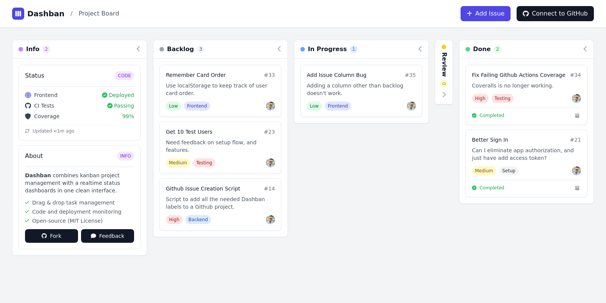

<h1 align="center">
  Dashban
  <br>
</h1>

<h4 align="center">A modern, responsive Kanban board application built with <a href="https://developer.mozilla.org/en-US/docs/Web/HTML">HTML</a>, <a href="https://tailwindcss.com">TailwindCSS</a>, and <a href="https://developer.mozilla.org/en-US/docs/Web/JavaScript">JavaScript</a>.</h4>

<div align="center">

[](https://github.com/super3/dashban/actions/workflows/frontend.yml)
[](https://github.com/super3/dashban/actions/workflows/test.yml)
[](https://coveralls.io/github/super3/dashban?branch=main)
[](https://github.com/super3/dashban/blob/main/LICENSE)

</div>

<p align="center">
  
</p>

## Quick Start
```bash
git clone https://github.com/super3/dashban.git && cd dashban
npm install && npm test
```

Open `index.html` in your browser to start using Dashban.

## 🚀 Frontend Deployment

This project includes a GitHub Actions workflow for automatic deployment to GitHub Pages. To enable deployment:

1. Go to your repository's **Settings** tab
2. Navigate to **Pages** in the left sidebar
3. Under **Source**, select **"GitHub Actions"**
4. The workflow will automatically deploy your site when you push to the `main` branch

Your Dashban application will then be available at: `https://yourusername.github.io/dashban`

## 🖥️ Backend (Node / Railway)

The board runs fully static on GitHub Pages, but there is also a small
[Express](https://expressjs.com/) server (`server.js`) so it can run on a Node
host such as [Railway](https://railway.app). The server serves the frontend and
exposes a tiny API (`/api/health`, `/api/config`); it is the foundation for the
upcoming Clerk "Sign in with GitHub" flow, which needs a server-side step to
obtain the GitHub token.

```bash
npm install
npm start        # serves the app on http://localhost:3000
```

Configuration is via environment variables (see [`.env.example`](.env.example)).
On Railway, set them in the project dashboard — `PORT` is provided automatically.

## 🔧 GitHub Integration Setup

To enable GitHub issue creation directly from Dashban:

### Create Personal Access Token
1. Go to **Settings > Developer settings > Personal access tokens > Fine-grained tokens**
2. Click **"Generate new token"**
3. Select your repository as the resource owner
4. Under permissions, grant **"Issues"** with **Read and Write** access
5. Generate the token and copy it